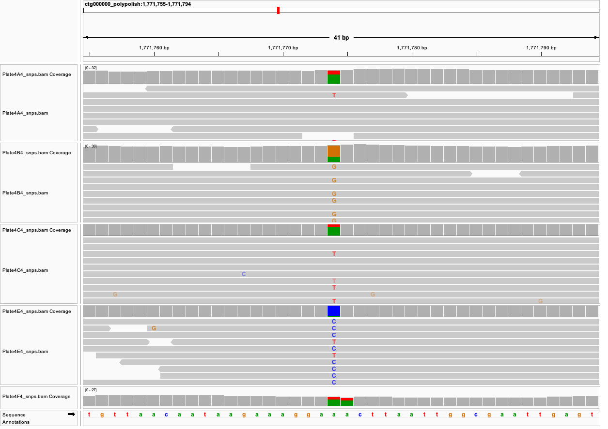
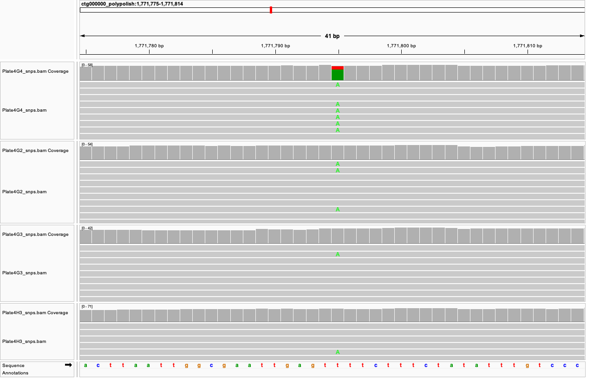
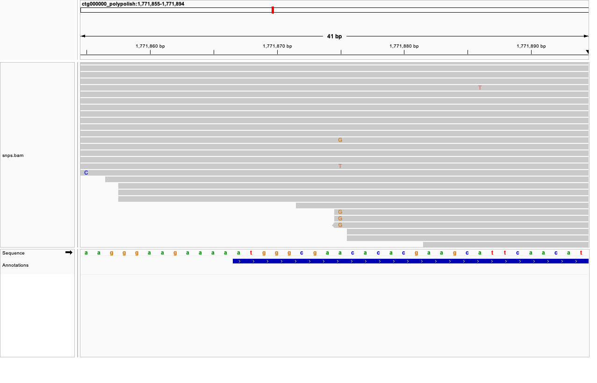
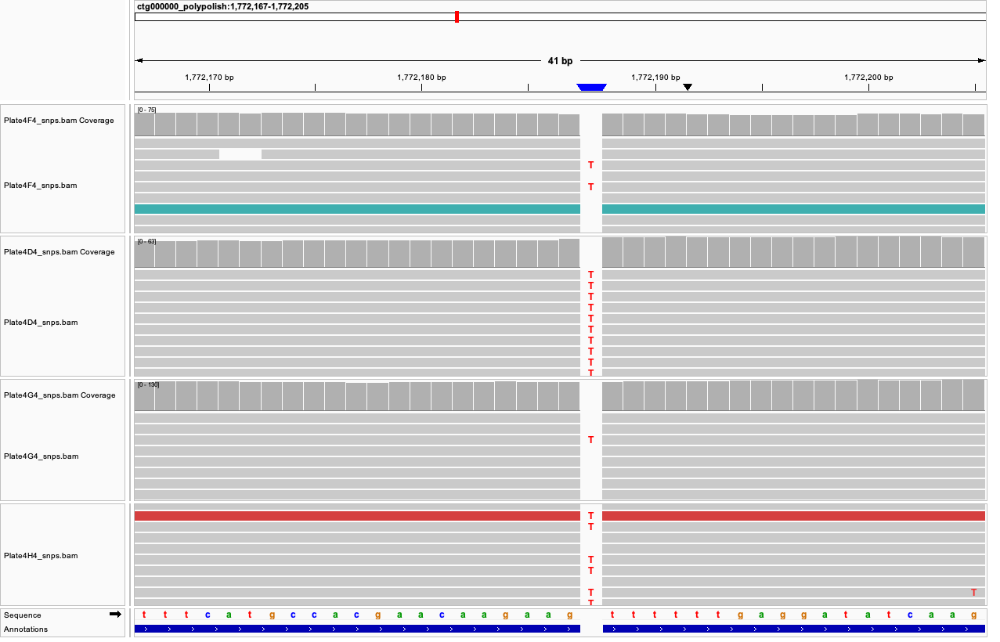

```{r setup, include=FALSE}
knitr::opts_chunk$set(echo = TRUE)
library(tidyverse)
library(ggplot2)
library(DiagrammeR)
library(kableExtra)
library(gggenes)
library(cowplot)
source("../../02.scripts_variants/settings.R")
```

## Compare the number of unfiltered variants in v2023 and v2025

To make sure the reproducibility, we re-processed all the samples from raw sequencing data to the final vcf with all intermediate files un-removed.

All samples except one (Plate1E4) have the exact same number of variants. Details see the scripts `pre_01_no_of_variants_stat.R` in the same folder.

In v2023, sample Plate1E4 (Aripiprazole, 50 µM) has only 360 variants while in v2025 in total 645 variants were called. [Log file](/rds-d6/user/rg684/hpc-work/ALE_20220823_sequencing_data_batch1/03.call_variant/20230714_vcf_80X_new_ref/04.snippy_all_fastq/mincov10_C3_F001/Plate1E4/snps.log) shows that bam file had I/O issues (this was not spot before due to the file was only partially corrupt).

All following re-analysis are based on v2025 (and should be the same as v2023 for all samples except Plate1E4).

```{r import, echo=FALSE}
  #v2025 <- readRDS("../03.merge_vcf/20250907_all_variants_redo.rds")
  v2025 <- readRDS("../03.merge_vcf/20250910_all_variants_redo_qual.rds")
  v2025$Evolved <- ifelse(v2025$Compound == "NT5002", "Parental", "Evolved")
```

## Allele Frequency (AF) destribution of all variants 

Below we show the distribution of allele frequency of all called variants (minimum coverage 10 ` --min-coverage 10`, minimum number of supporting observations 3 to consider a variant `-C 3`, minimum allele frequency 0.01 `-F 0.01`, minimum base quality 30 `-q 30`, minimum mapping quality 60 `-m 60` ) in parental populations (Sample_ID Plate1B9 and Plate1C9) and evolved populations. __Salmon line__ is showing the cutoff of AF 0.05, and __golden line__ is indicating AF 0.5.

```{r AF, echo=FALSE, message=FALSE, error=FALSE, fig.width=7, fig.height=3}
  ggplot(v2025, aes(log(Ratio))) +
    geom_histogram(bins = 100) +
    theme_bw() + labs(x = "Allele Frequency (log-transformed)",
                      y = "Number of variants") +
    facet_wrap(~Evolved, scales = "free") +
    geom_vline(xintercept = log(0.05), color = "salmon", linetype = "dashed")+
    geom_vline(xintercept = log(0.5), color = "gold", linetype = "dashed")
```

## Retrieve the QUAL information from vcf files 

Since the _snps.tab_ files are simplified and reformatted "vcf" files, we went back to _snps.vcf_ file for each sample to retrieve the quality value (QUAL) of variant calling.

QUAL estimates probability of being polymorphic:  
- phred 10 means probabilty of polymorphism > 0.9.  
- phred 20 means probability of polymorphism > 0.99.  
- phred 30 means probability of polymorphism > 0.999.  

Below we show the distribution of quality of all variants.

```{r qual_stat, echo=FALSE, message=FALSE, error=FALSE}
  v2025$QUAL_bi <- ifelse(v2025$QUAL == 0, "= 0", 
                          ifelse(v2025$QUAL <= 10, "0-10",
                                 ifelse(v2025$QUAL <= 20, "10-20",
                                        ifelse(v2025$QUAL <= 30, "20-30", ">30"))))  

  stat1 <- v2025 %>% group_by(QUAL_bi, Evolved) %>%
    summarise(No_of_variant = n())
  
  stat1$QUAL_bi <- factor(stat1$QUAL_bi, levels = c("= 0",
                                                    "0-10",
                                                    "10-20",
                                                    "20-30",
                                                    ">30"))
  stat1 <- stat1[order(stat1$QUAL_bi), ]
  kbl(stat1) %>% kable_styling(full_width = F)
```

## Filtering strategy 1

### Filter by quality (QUAL)

Below we are showing the distribution of variant quality after filtering out the variants with `QUAL < 1`. 

```{r qual, echo=FALSE, message=FALSE, error=FALSE, fig.width=7, fig.height=3}
  v2025_filter <- v2025[v2025$QUAL > 1, ]

  ggplot(v2025_filter, aes(log(QUAL))) +
    geom_histogram() +
    theme_bw() + labs(x = "Variant quality (log-transformed)",
                      y = "Number of variants") +
    facet_wrap(~Evolved, scales = "free") +
    geom_vline(xintercept = log(10), color = "salmon", linetype = "dashed") +
    geom_vline(xintercept = log(20), color =  "salmon", linetype = "dashed") +
    geom_vline(xintercept = log(30), color =  "salmon", linetype = "dashed")
    
```

Three dashed lines are indicating Q10, Q20 and Q30 (from left to right). We filter the variants with QUAL < 30.

We then plotted the distribution of number of high quality variant (Q > 30) in samples. 

```{r qual_filter, echo=FALSE, message=FALSE, error=FALSE, fig.width=4, fig.height=3}
  v2025_filter2 <- v2025[v2025$QUAL >= 30, ]
# 
#   kbl(v2025_filter2 %>% group_by(Compound) %>% summarise(No_of_variants = n()),
#                longtable = TRUE)
  filter2_stat <- v2025_filter2 %>% filter(Compound != "NT5002") %>%
    group_by(Compound) %>% summarise(No_of_variants = n())
  
  ggplot(filter2_stat, aes(No_of_variants)) +
    geom_histogram(binwidth = 1) +
    theme_bw() + labs(x = "Number of variant in each population with Q >= 30", y = "Number of evolved popultion")
  
```

### Identify parental strain variants

As shown in the table, parental strain (`Compound == "NT5002"`, with Sample_ID `Plate1B9` and `Plate1C9`) has 12 variants that passed the filter. We examined the AF as well as Ref and Alt depth of these variants.

```{r parental, echo=FALSE, message=FALSE, error=FALSE}
  parental <- v2025_filter2[v2025_filter2$Compound == "NT5002", ]

  kbl(parental[, c("Sample_ID", "POS", "QUAL", "Ref_depth", "Alt_depth",
                            "EFFECT", "PRODUCT")]) %>%
    kable_styling(bootstrap_options = c("striped", "hover"), full_width = F)
```

As we can see, most of the variants here are detected in both sequenced samples (two technical replicates), except for two positions. 

```{r parental_stat, echo=FALSE, message=FALSE, error=FALSE}
  kbl(parental %>% group_by(POS) %>% 
                 summarise(Count = n(), Avg_AF = mean(Ratio))) %>%
    kable_styling(bootstrap_options = c("striped", "hover"), full_width = F)
```

Previously, we defined:

>For the variant that appeared in both parental short-reads sequenced samples and with average AF higher than 90%, we identify those >as “parental variants” (including variants at the positions: 1166763, 1681625, 1702756, 3356587) that are highly possible false >positive due to mis-assembly. 

After manually check the mapping results (`snps.report.txt` files), all positions but _1914986_ have solid mapping results, so we will update the "parental variants" list: 

- previous ones 1166763, 1681625, 1702756, 3356587 
- potentially: plus newly added after releasing filtering & manual check: 1931428, 3256546 (Note: these two only detected in one of the parental samples)

Below we show the prevalence of these 6 variants in all samples:

```{r parental_variants_prevalence, echo=FALSE, message=FALSE, error=FALSE, fig.width=6, fig.height=3}
    parental_lst <- c("1166763", "1681625", "1702756", 
                    "1931428", "3256546", "3356587")
   parental_var <- v2025_filter2[v2025_filter2$POS %in% parental_lst, ]
   
    ggplot(parental_var, aes(as.factor(POS), Ratio)) + geom_boxplot(color = "gray47") +
      geom_jitter(color = "gray28") + theme_bw() + labs(x = "Position", y = "AF")
    
    kbl(parental_var %>% group_by(POS) %>% summarise(Prevalence = n())) %>%
      kable_styling(bootstrap_options = "striped", full_width = F, position = "float_right")
```

__Update__: we add/label two more variants as "parental variants" here.

### Filter out parental variants from evolved populations

We then filter out the parental variants from evolved populations. 

```{r filter_parental, echo=FALSE, message=FALSE, error=FALSE, fig.width=7, fig.height=3}
  evolved_var <- v2025_filter2[v2025_filter2$Compound != "NT5002", ]
  ## 1353 30
  evolved_var <- evolved_var[!(evolved_var$POS %in% parental_lst), ]
  ## 128 30
  
  evolved_var_stat <- evolved_var %>% group_by(Sample_ID, Compound, Concentration) %>%
    summarise(No_of_variants = n())
 
  ggplot(evolved_var_stat, aes(Compound, No_of_variants)) +
    #geom_boxplot() +
    geom_jitter(aes(color = Concentration)) +
    theme_bw() + labs(x = "Evolved populations",
                      y = "Number of variants") +
    scale_color_manual(values = c("gray", "deepskyblue", "deepskyblue4")) +
    theme(legend.position = "top",
          axis.text.x = element_text(angle = 90, hjust = 1, vjust = 0.5))
```

To __conclude__: the _re-filter-1_ we tried here

```{r filter_1, echo=FALSE, message=FALSE, error=FALSE, fig.width=6, fig.height=2}
  mermaid("
  graph LR;
      A[All variants] --> B[QUAL >= 30];
      B --> C[Filter out 6 parental variants]
  ")
```

Using the new filter (QUAL > 30, `r nrow(v2025_filter2)` variants remained; `r nrow(evolved_var)` variants remained after removing parental 6 variants), we dramatically decreased the false positive; but meanwhile the false negative is hugely increased.
See details about this in the last session [Xanthan gum related mutations].

## Filtering strategy 2 

Since filter by QUAL introduced false negative, we tried another filtering, will be referred 
as _re-filter-2_. This starts with the supporting reads number and the whole process is summarized below:

```{r filter_by_alt_depth, echo=FALSE, message=FALSE, error=FALSE, fig.width=12, fig.height=2}
  mermaid("
  graph LR;
      A[All variants] --> |486155|B[Alt_depth >= 5];
      B --> |23885|C[Allele frequency > 0.05];
      C --> |2115|D[Identify parental variants N = 15];
      D --> E[Remove parental variants];
      E --> |686|F[Evolved variants];
      F --> |199|G[Keep variants found in <= 3 compounds]
  ")
```

### Alt_depth filtering (> 5)

We firstly checked the distribution of `Alt_depth` of all variants. __Salmon line__ is showing the cutoff of 3 reads, and __golden line__ is indicating 5 reads. As we can see, most of the variants are in the range of < 5 supporting reads. 

```{r alt_depth_dis, echo=FALSE, message=FALSE, error=FALSE, fig.width=5, fig.height=2}
  #dim(v2025)
  ggplot(v2025, aes(log(Alt_depth))) + geom_density() + theme_bw() +
    geom_vline(xintercept = log(3), color = "salmon", linetype = "dashed")+
    geom_vline(xintercept = log(5), color = "gold", linetype = "dashed") +
    labs(x = "Log-transformed supporting reads number", y = "Density")
    
```

Below we show the number of variants in table:

```{r alt_depth_stat, echo=FALSE, message=FALSE, warning=FALSE, fig.width=7, fig.height=3}
  v2025$Alt_depth_stat <- ifelse(v2025$Alt_depth <= 3, "= 3", 
                          ifelse(v2025$Alt_depth <= 5, "(3, 5]",
                                 ifelse(v2025$Alt_depth <= 10, "(5, 10]",
                                        ifelse(v2025$Alt_depth <= 20, "(10, 20]", ">20"))))  

  stat2 <- v2025 %>% group_by(Alt_depth_stat, Evolved) %>%
    summarise(No_of_variant = n())
  
  stat2$Alt_depth_stat <- factor(stat2$Alt_depth_stat, levels = c("= 3",
                                                    "(3, 5]",
                                                    "(5, 10]",
                                                    "(10, 20]",
                                                    ">20"))
  stat2 <- stat2[order(stat2$Alt_depth_stat), ]
  kbl(stat2) %>% kable_styling(full_width = F)
  ggplot(stat2, aes(Alt_depth_stat, No_of_variant)) +
    geom_histogram(stat = 'identity', position = "dodge") +
    facet_wrap(~Evolved, scales = "free") + theme_bw()
```

We filtered out the variants called with no more than 5 supporting reads and then 
examined the quality of those passed the filtering. 

```{r filter_by_alt_depth_Q, echo=FALSE, message=FALSE, error=FALSE, fig.width=6, fig.height=2}
  v2025_filter4 <- v2025[v2025$Alt_depth >=5, ]
  kbl(v2025_filter4 %>% group_by(Evolved, QUAL_bi) %>% summarise(Quality_stat = n())) %>%
    kable_styling(full_width = F)
```

As we can see, after filtering by supporting reads number (Alt_depth), there are 
still many low quality variants in both parental and evolved strains. 

### Allele frequency filtering (> 0.05)

Below we also plot the allele frequency distribution of this intermediate filtering results.
The __salmon__ dash line indicates AF == 0.05.

```{r filter_by_alt_depth_AF_dis, echo=FALSE, message=FALSE, error=FALSE, fig.width=6, fig.height=3}
  ggplot(v2025_filter4, aes(Ratio)) + geom_density(aes(color = Evolved)) + theme_bw() +
    scale_color_manual(values = c("deepskyblue", "gray")) +
     geom_vline(xintercept = 0.05, color = "salmon", linetype = "dashed") +
    labs(x = "AF", y = "Density") +
    theme(legend.position = "right")
```

We then checked the quality of variants that has allele frequency < 0.05 and show that
all variants have quality 0. Therefore, we could apply the filter we used before (to keep AF > 0.05).

```{r filter_by_alt_depth_AF, echo=FALSE, message=FALSE, error=FALSE, fig.width=4, fig.height=3}
  # v2025_filter5 <- v2025_filter4[v2025_filter4$Ratio >= 0.05, ]
  # 
  # kbl(v2025_filter5 %>% group_by(QUAL_bi, Evolved) %>% summarise(Quality_stat = n()))
  # 
  
  v2025_filter4$AF <- ifelse(v2025_filter4$Ratio > 0.05, "> 0.05", "<= 0.05")
  
  ggplot(v2025_filter4, aes(QUAL, AF)) + geom_point(aes(color = AF), alpha = 0.8) +
    theme_bw() + theme(legend.position = "none") + labs(x = "Quality of the variants")
  
```

Re-check the quality after filtering with `Alt_depth > 5` and `Ratio > 0.05`.

```{r filter_by_alt_depth_and_AF, echo=FALSE, message=FALSE, error=FALSE}
  v2025_filter5 <- v2025[(v2025$Alt_depth >5) & (v2025$Ratio > 0.05), ]
  kbl(v2025_filter5 %>% group_by(Evolved, QUAL_bi) %>% summarise(Quality_stat = n())) %>%
    kable_styling(full_width = F)
```

### Idnetify parental variants - update the list again

We then plot the variant quality vs allele frequency to decide which variants to be defined as parental variants.

```{r parantal_variants_update, echo=FALSE, message=FALSE, error=FALSE, fig.width=5, fig.height=3}
  v2025_filter5_parental <- v2025_filter5[v2025_filter5$Compound == "NT5002", ]
  
  stat_prevalence <- v2025_filter5_parental %>% group_by(POS) %>% 
    summarise(Prevalence = n())  
  v2025_filter5_parental <- merge(v2025_filter5_parental, stat_prevalence)
  
  v2025_filter5_parental$Prevalence <- as.character(v2025_filter5_parental$Prevalence)
  
  ggplot(v2025_filter5_parental, aes(Sample_ID, Ratio, size = log(QUAL+1))) +
    geom_point(aes(color = Sample_ID, shape = Prevalence), position = "jitter") + 
    theme_bw() + labs(y = "AF") + scale_shape_manual(values = c(1, 2))
  
  t <- v2025_filter5_parental %>% select(Sample_ID, POS, Prevalence, EVIDENCE, 
                                         QUAL, Ratio, EFFECT,
                                         Compound, Concentration)
```

Despite the clear separation of AF and quality (also potential prediction bias from Freebayes),
to make sure we are not enabling false negative nor positive, we checked all the variants reported here either has
AF > 0.5 (i.e. good quality) or low AF/quality but found in both technical replicates using IGV.

After checking the mapping results, we decided to include:  

- all variants with AF > 0.5. 

- variants with prevalence == 2 (in triangle in the plot above). 

- variants with prevalence == 1 BUT good quality (Q > 10). 

- few exceptions confirmed that should be an existing variant but does not fulfill
above criteria but we "see" them: 1,939,963; 4,229,448; and 4,452,307   

So the parental variants now update as:

```{r parental_v2, echo=FALSE, message=FALSE, error=FALSE}
  lst1 <- unique(v2025_filter5_parental[v2025_filter5_parental$Ratio > 0.5, ]$POS)
  lst2 <- unique(v2025_filter5_parental[v2025_filter5_parental$Prevalence > 1, ]$POS)
  lst3 <- unique(v2025_filter5_parental[(v2025_filter5_parental$Prevalence == 1) &
                                          (v2025_filter5_parental$QUAL > 10), ]$POS)
  lst4 <- c("1939963","4229448","4452307")
  
  lst <- unique(c(lst1, lst2, lst3, lst4))
```

`r lst`

### Remove parental variants from evolved populations

We then remove the above defined parental variants from the evolved populations.

```{r filter5_evolved, echo=FALSE, message=FALSE, error=FALSE, fig.width=5, fig.height=3}
  v2025_filter5_evolved <- v2025_filter5[v2025_filter5$Compound != "NT5002", ]
  
  v2025_filter5_evolved <- v2025_filter5_evolved[!(v2025_filter5_evolved$POS %in% lst), ]
# 
#   ggplot(v2025_filter5_evolved, aes(Sample_ID, Ratio, size = log(QUAL+1))) +
#     geom_point(aes(color = Sample_ID), position = "jitter", shape = 1) + 
#     theme_bw() + labs(y = "AF") + theme(legend.position = "none")
  
  # ggplot(v2025_filter5_evolved, aes(log(QUAL + 1), Ratio)) +
  #   geom_point(aes(color = Sample_ID), position = "jitter", shape = 1) + 
  #   theme_bw() + labs(x = "Log-transformed quality", y = "AF") + theme(legend.position = "none")
  
  v2025_filter5_evolved <- v2025_filter5_evolved %>% group_by(POS) %>%
    mutate(Comp_Prevalence = n_distinct(Compound))
  
  multi_comp_lst <- v2025_filter5_evolved[v2025_filter5_evolved$Comp_Prevalence > 2, ]
```

After filtering out updated parental variants, we have `r nrow(v2025_filter5_evolved)` variants at 
`r length(unique(v2025_filter5_evolved$POS))` positions. 

### Filter out variants appeared in more than 3 compounds [discuss?]

We then looked at the compound prevalence,
i.e. the number of different condition that specific variants were found in.

```{r cmp_prevalence,echo=FALSE, message=FALSE, error=FALSE, warning = FALSE, fig.width=3, fig.height=3}
  cmp_pre_stat <- unique(v2025_filter5_evolved[, colnames(v2025_filter5_evolved) %in% c("POS", "Comp_Prevalence")])

  ggplot(cmp_pre_stat, aes(Comp_Prevalence)) +
    geom_histogram() + theme_bw() + 
    labs(x = "Number of compound", y = "Number of variants") +
    geom_vline(xintercept = 3, color = "salmon", linetype = "dashed")    

```

As we can see, most of the variants were found in only 1-3 compounds, following the discussion
we (Simone, Sonja, and Rui) had in Aug, we will filter out the variants that appeared in more than 
3 different compounds.

```{r filter_cmp_prevalence, echo=FALSE, message=FALSE, error=FALSE}
  v2025_filter5_evolved <- v2025_filter5_evolved[v2025_filter5_evolved$Comp_Prevalence <= 3, ]
```

We now have we have `r nrow(v2025_filter5_evolved)` variants at 
`r length(unique(v2025_filter5_evolved$POS))` positions.

## Xanthan gum related mutations - Figure 2d

We here show the mapping of genetic variants detected in populations evolved with
xanthan gum, as we reported in __Figure 2d__ in current version manuscript.

Current filtering (reported in the current manuscript, filtering strategy 0):

```{r filter_0, echo=FALSE, message=FALSE, error=FALSE, fig.width=6, fig.height=2}
  mermaid("
  graph LR;
      A[All variants] --> B[Allele frequency > 0.05];
      B --> C[Filter out 4 parental variants] 
  ")
```

We showed that multiple samples with the variants detected at the same position.

```{r figure2d, echo=FALSE, message=FALSE, error=FALSE, warning = FALSE, fig.width=4, fig.height=4}
    pos_gene <- read.table("../../00.data/vcf_20231025_position_gene_map.txt",
                           header = F, sep = "\t")
    colnames(pos_gene) <- c("POS", "Type", "Gene")
    map <- read.table("../../00.data/vcf_20231024_effect_map.txt", 
                      header = T, sep = "\t")
    map$Effect_type <- as.factor(map$Effect_type)
    gff <-read.delim("../../00.data/annot_RAST_simp.gff", header = F, sep = "\t")
    colnames(gff) <- c("Start", "End", "Strand", "Gene_ID", "Annotation")
    
    v2025_filter3 <- v2025[v2025$Ratio > 0.05, ]
    
    f2d <- merge(v2025_filter3, pos_gene)
    
    #### Panel D - AcrR 
    this_gene_ID <- c("peg.1416", "peg.1417")
    
    this_gene <- f2d[f2d$Gene %in% this_gene_ID, ]
    this_gene <- merge(this_gene, map)
    
    ## Get the coordinate of this gene
    this_gff <- gff[gff$Gene_ID %in% this_gene$Gene, ]
    this_start <- min(this_gff$End)
    this_end <- max(this_gff$End)
    
    this_gene <- this_gene[this_gene$POS > this_start, ]
    
    p1 <- ggplot(this_gene, aes(POS, Ratio)) +
      geom_point(aes(color = Compound, shape = Effect_type, size = Concentration),
                 alpha = 0.9) + 
      xlim(this_start, this_end) +
      labs(x = "", y = "AF") +
      scale_size_manual(values = c("0" = 1,
                                   "25" = 1.8, 
                                   "50" = 2.4), guide = "none") +
      scale_color_manual(values = c("Xanthan_gum" = "slateblue3",
                                    "Others" = "gray")) +
      scale_shape_manual(limits = map$Effect_type, values = map$Shape, guide = "none") +
      theme_bw() +
      theme(legend.position = "top") +
      guides(color = guide_legend(nrow = 2)) +
      theme(legend.background = element_blank())
    
    colnames(this_gff) <- c("start", "end", "strand", "gene", "protein")
    this_gff$orientation <- ifelse(this_gff$strand == "+", 1, 0)
    this_gff$molecule <- " "
    
    p2 <- ggplot(this_gff, aes(xmin = start, xmax = end,
                               y = molecule, fill = protein, 
                               forward = orientation)) +
      xlim(this_start, this_end) +
      geom_gene_arrow() + labs(y = "") +
      scale_fill_brewer(palette = "Purples") +
      theme_genes() +
      theme(legend.position = "none",
            panel.background = element_blank(),
            plot.background = element_blank()) 
    
    plot_grid(p1, p2, nrow = 2, align = "v",  axis = "l", 
                     rel_heights = c(4, 1))
```

The detailed information about these variants are shown below:

```{r figure2d_tab, echo=FALSE, message=FALSE, error=FALSE}
  kbl(this_gene[, c("Sample_ID", "POS", "QUAL", "Ref_depth", "Alt_depth", "Ratio",
                    "Compound", "Concentration",
                            "EFFECT", "PRODUCT", "QUAL_bi")]) %>%
    kable_styling(bootstrap_options = c("striped", "hover"))
```

In total, `r length(this_gene$POS)` variants at `r length(unique(this_gene$POS))`
positions were shown here. From the table above, we can see that not all have good
quality.

```{r figure2d_tab_stat, echo=FALSE, message=FALSE, error=FALSE}
  f2d_stat <- this_gene %>% group_by(POS) %>% summarise(Prevalence = n())
  kbl(f2d_stat) %>% 
    kable_styling(bootstrap_options = c("striped", "hover"), full_width = F)
```

We will use the IGV_2.19.6 to visualize these variants (in xanthan gum evolved populations) one by one.

At the position __1,771,774__, we saw variants in four samples. Two of them (A -> C/T in Plate4E4   
and A -> G in Plate4B4) are high quality and the other two are low quality (A -> T in Plate4A4 and Plate4C4). From the
IGV mapping, we could see another sample in Plate4F4 have variant (A -> T) but not reported in
vcf file. 



```{r v1, echo=FALSE, message=FALSE, error=FALSE}
 kbl(this_gene %>% filter(POS == 1771774) %>% select(Sample_ID, EVIDENCE, QUAL)) %>%
      kable_styling(full_width = F)
```


Next we are looking at the position __1,771,795__ with only one sample (Plate4G4) has good quality.



```{r v2, echo=FALSE, message=FALSE, error=FALSE}
 kbl(this_gene %>% filter(POS == 1771795) %>% select(Sample_ID, EVIDENCE, QUAL)) %>%
      kable_styling(full_width = F)
```

The third variant we are looking at the position __1,771,875__ with only one sample annotated (not xanthan gum, QUAL == 0).
The evidence show 4 reads supporting A->G but the mapping shows they are all at the end of the reads. So this likely to
be a false positive variant. 

```{r v3, echo=FALSE, message=FALSE, error=FALSE}
 kbl(this_gene %>% filter(POS == 1771875) %>% select(Sample_ID, EVIDENCE, QUAL)) %>%
      kable_styling(full_width = F)
```



Lastly we are looking at the position __1,771,795__ that appeared in five (four are xanthan gum evolved) samples.



```{r v4, echo=FALSE, message=FALSE, error=FALSE}
 kbl(this_gene %>% filter(POS == 1772187) %>% select(Sample_ID, EVIDENCE, QUAL)) %>%
      kable_styling(full_width = F)
```

As we shown above, if we filter out variants with QUAL < 1 using [Filtering strategy 1], we will have the following variants remain:

```{r filter_q, echo=FALSE, message=FALSE, error=FALSE}
 kbl(this_gene %>% filter(QUAL >= 30) %>% select(Sample_ID, POS, EVIDENCE, QUAL, EFFECT,
                                               Compound, Concentration)) %>%
      kable_styling(full_width = F)
```

Alternatively, we could choose to filter out the variants that have < 5 reads support using [Filtering strategy 2]:

```{r filter_depth, echo=FALSE, message=FALSE, error=FALSE}
 kbl(this_gene %>% filter(Alt_depth > 4) %>% filter(Ratio > 0.05) %>%
     select(Sample_ID, POS, EVIDENCE, QUAL, EFFECT, Compound, Concentration)) %>%
      kable_styling(full_width = F)
```

We observe that [Filtering strategy 2] performs the best regarding the lowest false positive and negative variants; evaluated by the IGV.

## Update Figure 2 with filtering strategy 2

We then re-plotted figure 2 with the new filtering strategy.

```{r figure_2abc, warning=FALSE, echo=FALSE, message=FALSE, fig.height=9, fig.width=10}
  all <- v2025_filter5_evolved
    t1 <- all %>% group_by(POS) %>% summarise(Prevalence =
                                              length(unique(Sample_ID)),
                                            Average_AF = mean(Ratio))
  t1_des <- unique(all[, c("POS", "FTYPE", "Effect")])
  t1 <- merge(t1, t1_des)
  
  map <- read.table("../../00.data/vcf_20231024_effect_map.txt", 
                    header = T, sep = "\t")
  map$Effect_type <- as.factor(map$Effect_type)
  #map$Shape <- as.factor(map$Shape)
  
  t1 <- merge(t1, map)
  
  p1_1 <- ggplot(t1, aes(POS, Prevalence)) +
    annotate("rect", ymin=-Inf, ymax=Inf, xmin=1910551, xmax=1944637, 
             alpha=0.3, fill="skyblue") + 
    geom_point(aes(color = FTYPE, size = Average_AF, shape = Effect_type),
               alpha = 0.7) + 
    scale_shape_manual(limits = map$Effect_type,
                       values = map$Shape) +
    scale_color_manual(values = c("gold", "gray47")) +
    xlim(c(0, 4.685e+06)) + xlab("") +
    scale_size(range = c(0.25, 5), limits = c(0.05, 1)) +
    theme_minimal_hgrid(color = "gray88", font_size = 10) +
    guides(colour = guide_legend(order = 2, nrow = 1), 
           size = guide_legend(order = 3, nrow = 1),
           shape = guide_legend(order = 1, nrow = 1)) +
    main_theme + theme(legend.position = "top")
  
  legend <- get_plot_component(p1_1, 'guide-box-top', return_all = TRUE)
  p1_1 <- p1_1 + theme(legend.position = "none")
  
  p1_2 <- ggplot(all, aes(POS)) + 
    geom_density(aes(color = FTYPE, y = ..scaled..)) +
    scale_color_manual(values = c("gold", "gray47")) +
    scale_y_continuous(position = "right") +
    xlab("") + ylab("Density of variants") +
    xlim(c(0, 4.685e+06)) +
    theme_minimal_hgrid(color = "gray88", font_size = 10) +
    theme(legend.position = "none",
          axis.text.x=element_blank()) +
    main_theme
  
  aligned_plots <- align_plots(p1_2, p1_1, align="hv", axis="tblr")
  p_a <- ggdraw(aligned_plots[[2]]) + draw_plot(aligned_plots[[1]])
  p_a <- plot_grid(legend, p_a, nrow = 2, rel_heights = c(0.2, 1))
  
  #####################
  all_05 <- v2025_filter5_evolved[v2025_filter5_evolved$Ratio > 0.5, ]
t1 <- all_05 %>% group_by(POS) %>% summarise(Prevalence =
                                            length(unique(Sample_ID)),
                                          Average_AF = mean(Ratio))
t1_des <- unique(all_05[, c("POS", "FTYPE", "Effect")])
t1 <- merge(t1, t1_des)
t1 <- merge(t1, map)

p2_1 <- ggplot(t1, aes(POS, Prevalence)) +
  annotate("rect", ymin=-Inf, ymax=Inf, xmin=1910551, xmax=1944637, 
           alpha=0.3, fill="skyblue") + 
  geom_point(aes(color = FTYPE, size = Average_AF, shape = Effect_type),
             alpha = 0.7) + 
  scale_color_manual(values = c("gold", "gray47")) +
  xlab("Position") +
  scale_shape_manual(limits = map$Effect_type,
                     values = map$Shape) + 
  theme_minimal_hgrid(color = "gray88", font_size = 10) +
  scale_size(range = c(0.25, 5), limits = c(0.05, 1)) +
  xlim(c(0, 4.685e+06)) +
  guides(colour = guide_legend(order = 1, nrow = 1), 
         size = guide_legend(order = 2, nrow = 1),
         shape = guide_legend(order = 3, nrow = 1)) +
  theme(legend.position = "bottom",
        legend.justification = c("left", "center")) +
  main_theme 

legend <- get_plot_component(p2_1, 'guide-box-bottom', return_all = TRUE)
p2_1 <- p2_1 + theme(legend.position = "none")

p2_2 <- ggplot(all_05, aes(POS)) + 
  geom_density(aes(color = FTYPE, y = ..scaled..)) +
  scale_color_manual(values = c("gold", "gray47")) +
  scale_y_continuous(position = "right") +
  xlab("") + ylab("Density of variants") +
  xlim(c(0, 4.685e+06)) +
  theme_minimal_hgrid(color = "gray88", font_size = 10) +
  theme(legend.position = "none",
        axis.text.x=element_blank()) +
  main_theme

aligned_plots <- align_plots(p2_2, p2_1, align="hv", axis="tblr")
p2 <- ggdraw(aligned_plots[[2]]) + draw_plot(aligned_plots[[1]])
p_b <- plot_grid(legend, p2, nrow = 2, rel_heights = c(0.2, 1))

library(gggenes) 

gff <-read.delim("../../00.data/annot_RAST_simp.gff", header = F, sep = "\t")
colnames(gff) <- c("Start", "End", "Strand", "Gene_ID", "Annotation")

region <- all[(all$POS > 1910551) & (all$POS < 1944637), ]
region <- merge(region, map)

gene_lst <- paste0("peg.", seq(1535, 1563))
region_gff <- gff[gff$Gene_ID %in% gene_lst, ]

## Get the coordinate of this gene
this_start <- min(region_gff$Start)
this_end <- max(region_gff$End)

colnames(region_gff) <- c("start", "end", "strand", "gene", "protein")

region_gff$orientation <- ifelse(region_gff$strand == "+", 1, 0)
region_gff$molecule <- ""

p_c1 <- ggplot(region_gff, aes(xmin = start, xmax = end,
                             y = molecule, fill = protein, 
                             forward = orientation)) +
  geom_gene_arrow() + labs(y = "") +
  xlim(this_start, this_end) +
  scale_fill_brewer(palette = "Set3") +
  theme_genes() +
  theme(legend.position = "none")

region <- region[!(region$Sample_ID %in% c("Plate1B9",
                                           "Plate1C9")), ]

##AF of each variants from each compounds
p_c2 <- ggplot(region, aes(POS, Ratio)) +
  geom_point(aes(color = Concentration, shape = Effect_type), 
             size = 3, alpha = 0.8) +
  xlim(this_start, this_end) +
  scale_shape_manual(limits = map$Effect_type,
                     values = map$Shape, guide = F) +
  scale_color_manual(values = c("0" = "gray",
                                "25" = "#a0cbe8", 
                                "50" = "#1170aa")) +
  labs(x = "", y = "Allele Frequence (AF)") +
  theme_bw() +
  theme(legend.position = "top", 
        legend.justification = c("left", "center")) +
  theme(legend.background = element_blank()) 

p_c <- plot_grid(p_c2, p_c1, nrow = 2, rel_heights = c(4, 1),
          align = "v", axis = "l")

fig2_abc <- plot_grid(p_a, p_b, p_c, nrow = 3, align = "v", axis = "lr", 
                  rel_heights = c(1, 1, 1.3), 
                  labels = c('a', "b", "c"))

fig2_abc  
```

As we can see, the "enrichment" of variants round SusC/D was filtered out. 

The panel _d_ and _e_ now look:

```{r figure_2de_filter2, warning=FALSE, echo=FALSE, message=FALSE, fig.height=4, fig.width=10}
  pos_gene <- read.table("../../00.data/vcf_20231025_position_gene_map.txt",
                       header = F, sep = "\t")
colnames(pos_gene) <- c("POS", "Type", "Gene")
all <- merge(all, pos_gene)

#### Panel D - AcrR 
this_gene_ID <- c("peg.1416", "peg.1417")

this_gene <- all[all$Gene %in% this_gene_ID, ]
this_gene <- merge(this_gene, map)

## Get the coordinate of this gene
this_gff <- gff[gff$Gene_ID %in% this_gene$Gene, ]
this_start <- min(this_gff$End)
this_end <- max(this_gff$End)

p1 <- ggplot(this_gene, aes(POS, Ratio)) +
  geom_point(aes(color = Compound, shape = Effect_type, size = Concentration),
             alpha = 0.9) + 
  xlim(this_start, this_end) +
  labs(x = "", y = "AF") +
  scale_size_manual(values = c("0" = 1,
                               "25" = 1.8, 
                               "50" = 2.4), guide = F) +
  scale_color_manual(values = c("Xanthan_gum" = "slateblue3",
                                "Others" = "gray")) +
  scale_shape_manual(limits = map$Effect_type, values = map$Shape, guide = F) +
  theme(legend.position = "top") +
  guides(color = guide_legend(nrow = 2)) +
  main_theme +
  theme(legend.background = element_blank())

colnames(this_gff) <- c("start", "end", "strand", "gene", "protein")
this_gff$orientation <- ifelse(this_gff$strand == "+", 1, 0)
this_gff$molecule <- " "

p2 <- ggplot(this_gff, aes(xmin = start, xmax = end,
                           y = molecule, fill = protein, 
                           forward = orientation)) +
  xlim(this_start, this_end) +
  geom_gene_arrow() + labs(y = "") +
  scale_fill_brewer(palette = "Purples") +
  theme_genes() +
  theme(legend.position = "none",
        panel.background = element_blank(),
        plot.background = element_blank()) 

p_d <- plot_grid(p1, p2, nrow = 2, align = "v",  axis = "l", 
                 rel_heights = c(4, 1))

###############################################################################
#### Panel E
this_gene_ID <- c( "peg.1703", "peg.1704")

this_gene <- all[all$Gene %in% this_gene_ID, ]
this_gene <- merge(this_gene, map)

## Get the coordinate of this gene
this_gff <- gff[gff$Gene_ID %in% this_gene$Gene, ]
this_start <- min(this_gff$Start)
this_end <- max(this_gff$End)

p1 <- ggplot(this_gene, aes(POS, Ratio)) +
  geom_point(aes(color = Compound, shape = Effect_type, size = Concentration),
             alpha = 0.9) + 
  xlim(this_start, this_end) +
  labs(x = "", y = "AF") +
  scale_size_manual(values = c("0" = 1,
                               "25" = 1.8, 
                               "50" = 2.4), guide = F) +
  scale_color_manual(values = c("Loperamide" = "#98dd94",
                                "Others" = "gray")) +
  scale_shape_manual(limits = map$Effect_type, values = map$Shape, guide = F) +
  theme(legend.position = "top") +
  guides(color = guide_legend(nrow = 2)) +
  main_theme +
  theme(legend.background = element_blank())

colnames(this_gff) <- c("start", "end", "strand", "gene", "protein")
this_gff$orientation <- ifelse(this_gff$strand == "+", 1, 0)
this_gff$molecule <- " "

p2 <- ggplot(this_gff, aes(xmin = start, xmax = end,
                           y = molecule, fill = protein, 
                           forward = orientation)) +
  xlim(this_start, this_end) +
  geom_gene_arrow() + labs(y = "") +
  scale_fill_manual(values = c("#98dd94", "#72a66f")) +
  theme_genes() +
  theme(legend.position = "none",
        panel.background = element_blank(),
        plot.background = element_blank()) 

p_e <- plot_grid(p1, p2, nrow = 2, align = "v",  axis = "l", 
                 rel_heights = c(4, 1))

###############################################################################
####
fig2_de <- plot_grid(p_d, p_e, nrow = 1, align = "h", axis = "b", 
                   labels = c("d", "e"))
fig2_de
```

As we can see, these two panel results are clearer comparing to before, with all the previous results remain the same.